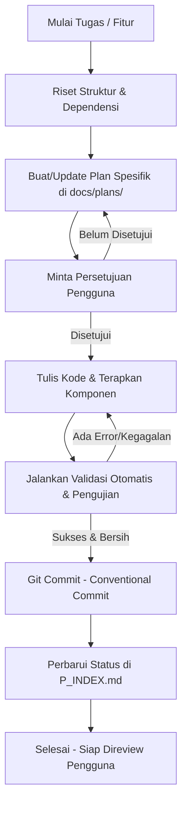

# 🗺️ ORKESTRATOR UTAMA - PLAN INDEX (`P_INDEX.md`)

Dokumen ini berfungsi sebagai peta jalan (roadmap), panduan alur kerja (workflow), dan index rencana implementasi frontend **As-Sakinah Mart**. Setiap agen AI yang bekerja di repositori ini wajib membaca dan memperbarui indeks ini untuk memantau progres pengembangan fitur secara terstruktur.

---

## 📌 1. Deskripsi Proyek & Peran Orkestrator

**As-Sakinah Mart** adalah toko online kebutuhan rumah tangga modern yang dirancang khusus untuk target pengguna wanita berusia 30-40 tahun di wilayah pedesaan. Desain mengutamakan kesederhanaan, keterbacaan yang sangat tinggi, navigasi intuitif, dan kejelasan visual.

**Peran Orkestrator (`P_INDEX.md`):**
1.  **Sumber Kebenaran Jalur Implementasi:** Memandu pembuatan dan eksekusi rencana kerja yang terbagi menjadi sub-rencana terperinci (Plan).
2.  **Validator Standar Kualitas:** Menjamin setiap fitur memenuhi kriteria SEO, Aksesibilitas (A11y), Performa, dan JSDoc secara konsisten.
3.  **Pelacak Status Pengembangan:** Memberikan status yang jelas untuk setiap modul yang sedang atau telah dibangun.

---

## 🔄 2. Alur Kerja AI (AI Workflow)

Setiap agen AI wajib mengikuti siklus alur kerja berulang (Iterative Development Workflow) berikut untuk setiap tugas/fitur:

### Rincian Alur Kerja:
1.  **Riset:** Periksa komponen yang sudah ada, hooks, dan utilitas di bawah `src/` agar tidak terjadi duplikasi (Prinsip DRY).
2.  **Pembuatan Plan:** Rancang file markdown rencana baru di bawah `docs/plans/` (misalnya: `01_beranda_dan_layout.md`). Rencana harus merinci file mana saja yang akan dibuat/diubah.
3.  **Eksekusi:** Tulis kode TypeScript yang aman, bersih, dan berdaya guna tinggi. Gunakan Shadcn UI + Tailwind CSS v4, Zustand, dan Tanstack Query.
4.  **Verifikasi Otomatis:**
    *   Uji fungsionalitas unit: `npm run test`
    *   Verifikasi Lighthouse & A11y: `npm run validate:success`
    *   Dokumentasi JSDoc: `npm run jsdoc:generate` (untuk menyisipkan template) & `npm run jsdoc:check` (untuk memastikan 0 error).
5.  **Git Commit:** Lakukan commit perubahan secara lokal dengan format Conventional Commits (contoh: `feat: add product list page with filter`).
6.  **Batas Push:** **JANGAN** lakukan `git push` ke repositori remote.

---

## 🚫 3. Batasan-Batasan Pengembangan (Constraints)

Agen AI **wajib** mematuhi batasan-batasan teknis berikut tanpa pengecualian:

*   **Pencegahan Git Push:** Dilarang keras memicu perintah `git push` secara otomatis. Proses push sepenuhnya dikendalikan oleh pengguna.
*   **Format Git Commit:** Wajib menggunakan pesan Conventional Commits (misal: `feat:`, `fix:`, `docs:`, `style:`, `refactor:`, `test:`, `chore:`).
*   **TypeScript Strict Mode:** Bebas dari tipe data `any` implisit, casting yang tidak aman, dan compiler warnings.
*   **Prinsip DRY (Don't Repeat Yourself):**
    *   Pindahkan logika kalkulasi/format data ke [src/utils/](file:///e:/PROJECT/SKRIPSI/frontend/src/utils).
    *   Pindahkan stateful logic berulang ke [src/hooks/](file:///e:/PROJECT/SKRIPSI/frontend/src/hooks).
    *   Gunakan kembali komponen visual dari [src/components/ui/](file:///e:/PROJECT/SKRIPSI/frontend/src/components/ui) dan [src/components/shared/](file:///e:/PROJECT/SKRIPSI/frontend/src/components/shared).
*   **Arsitektur TanStack Router:**
    *   Pertahankan pemisahan tegas antara routing dan visual.
    *   Direktori [src/routes/](file:///e:/PROJECT/SKRIPSI/frontend/src/routes) hanya mendefinisikan rute dan melakukan pemuatan data (*loader*).
    *   Direktori [src/pages/](file:///e:/PROJECT/SKRIPSI/frontend/src/pages) berisi implementasi komponen visual utama halaman untuk menjaga kebersihan routing dan kemudahan pengujian komponen secara terisolasi.
*   **Aturan Penamaan Berkas & Simbol:**
    *   Fungsi & Variabel: `camelCase`
    *   Class & Komponen React: `PascalCase`
    *   Type & Interface: `PascalCase` dengan awalan huruf `I` (contoh: `IProduct`, `IUser`)
    *   Berkas Halaman & Komponen: `PascalCase` (contoh: `ProductCard.tsx`, `Dashboard.tsx`)
    *   Berkas Hooks: `camelCase` dengan awalan `use` (contoh: `useCart.ts`)
*   **Desain & CSS:**
    *   Gunakan utility class **Tailwind CSS v4** secara konsisten.
    *   Gunakan palet warna utama `#00AA5B` (Hijau Tokopedia Fresh) dan skema warna pendukung yang didefinisikan dalam `GEMINI.md`.

---

## 🛠️ 4. Daftar Skill Lokal (Local Skills Reference)

Gunakan skill lokal yang tersedia untuk mengoptimalkan kode dan memastikan kualitas aplikasi:

| Nama Skill | Deskripsi & Tujuan | Perintah Eksekusi |
| :--- | :--- | :--- |
| **`jsdoc-generator`** | Memastikan semua fungsi, class, custom hooks, dan komponen React memiliki dokumentasi terstandarisasi. | • Validasi: `npm run jsdoc:check` • Auto-generate: `npm run jsdoc:generate` |
| **`success-criteria-validator`** | Memvalidasi kepatuhan kode terhadap kriteria Lighthouse (SEO: 100, A11y: 98-100, Performa: 95-100, Best Practice: 95-100). | • Validasi: `npm run validate:success` |
| **`modern-web-guidance`** | Mencari praktik terbaik pengembangan web modern (LCP, visual, accessibility) untuk menghindari penggunaan library eksternal berlebih. | • Cari: `npx -y modern-web-guidance@latest search "<query>" --skill-version 2026_05_16-c5e7870` |

---

## 📋 5. Daftar Rencana Pengembangan (Plan Registry)

Berikut adalah daftar rencana implementasi halaman dan fitur As-Sakinah Mart yang diatur secara bertahap. Klik pada tautan untuk membuka berkas rencana kerja masing-masing halaman.

| No | Modul / Halaman | Berkas Rencana (Plan File) | Target File Output | Status |
| :---: | :--- | :--- | :--- | :---: |
| **1** | **Beranda & Tata Letak Utama** | [01_beranda_dan_layout.md](file:///e:/PROJECT/SKRIPSI/frontend/docs/plans/01_beranda_dan_layout.md) | `src/pages/main/Home.tsx` `src/components/layout/Navbar.tsx` `src/components/layout/Footer.tsx` | 🟢 Selesai |
| **2** | **Katalog & Detail Produk** | [02_katalog_dan_produk.md](file:///e:/PROJECT/SKRIPSI/frontend/docs/plans/02_katalog_dan_produk.md) | `src/pages/main/ProductList.tsx` `src/pages/main/ProductDetail.tsx` `src/routes/products/index.tsx` `src/routes/products/$slug.tsx` | ⚪ Belum Mulai |
| **3** | **Keranjang Belanja Offline & Checkout** | [03_keranjang_dan_checkout.md](file:///e:/PROJECT/SKRIPSI/frontend/docs/plans/03_keranjang_dan_checkout.md) | `src/pages/main/Cart.tsx` `src/routes/cart.tsx` `src/libs/zustand/cartStore.ts` | ⚪ Belum Mulai |
| **4** | **Autentikasi, Profil & Keamanan** | [04_autentikasi_dan_profil.md](file:///e:/PROJECT/SKRIPSI/frontend/docs/plans/04_autentikasi_dan_profil.md) | `src/pages/main/Profile.tsx` `src/pages/main/ProfileEdit.tsx` `src/pages/main/ChangePassword.tsx` `src/routes/profile/` | ⚪ Belum Mulai |
| **5** | **Riwayat Transaksi & Riwayat Pesanan** | [05_riwayat_pesanan.md](file:///e:/PROJECT/SKRIPSI/frontend/docs/plans/05_riwayat_pesanan.md) | `src/pages/main/OrderList.tsx` `src/pages/main/OrderDetail.tsx` `src/routes/orders/` | ⚪ Belum Mulai |
| **6** | **Admin Dashboard & Visualisasi Penjualan** | [06_admin_dashboard.md](file:///e:/PROJECT/SKRIPSI/frontend/docs/plans/06_admin_dashboard.md) | `src/pages/admin/DashboardPage.tsx` `src/routes/admin/dashboard.tsx` | ⚪ Belum Mulai |
| **7** | **Admin Manajemen (Produk, Kategori, Order, User)** | [07_admin_manajemen.md](file:///e:/PROJECT/SKRIPSI/frontend/docs/plans/07_admin_manajemen.md) | `src/pages/admin/ManageProducts.tsx` `src/pages/admin/ManageCategories.tsx` `src/pages/admin/ManageOrders.tsx` `src/pages/admin/ManageUsers.tsx` | ⚪ Belum Mulai |

> **Keterangan Status:**
> *   ⚪ *Belum Mulai (Not Started)*
> *   🟡 *Sedang Dikerjakan (In Progress)*
> *   🟢 *Selesai & Tervalidasi (Done & Validated)*

---

## 📐 6. Ringkasan Token Desain & Spesifikasi WCAG AA

Untuk menjaga visual yang premium dan nyaman bagi target pengguna wanita pedesaan, selalu gunakan nilai-nilai CSS ini:

*   **Pilihan Warna Kontras Tinggi:**
    *   Warna Dasar Latar Belakang: `bg-[#F4F6F8]` (lembut, tidak silau).
    *   Warna Card / Permukaan: `bg-[#FFFFFF]` dengan outline tipis `border-[#E5E7EB]`.
    *   Teks Utama (Neutral): `text-[#080808]` (kontras tinggi di atas putih).
    *   Teks Pendukung: `text-[#6B7280]` (tetap terbaca jelas).
    *   Warna Sukses / Aksi Utama: `bg-[#00AA5B]` (Hijau Tokopedia Fresh).
*   **Tipografi Mudah Dibaca:**
    *   Font-family fallback: `Nunito Sans` (sangat nyaman dibaca oleh mata yang menua atau kurang terbiasa dengan font modern kecil).
    *   Ukuran Font Body: Minimal `text-sm` (14px) untuk teks keterangan, prioritaskan `text-base` (16px) untuk deskripsi dan ringkasan produk.
*   **Interaktivitas Jelas:**
    *   Gunakan ukuran tombol minimal tinggi 44px atau lebar 44px agar mudah disentuh oleh jari pada layar ponsel (karena mayoritas ibu-ibu desa akan mengakses via handphone).
    *   Indikator Hover & Active: Pastikan tombol berubah warna secara halus saat ditekan untuk memberikan umpan balik (feedback) visual instan.
